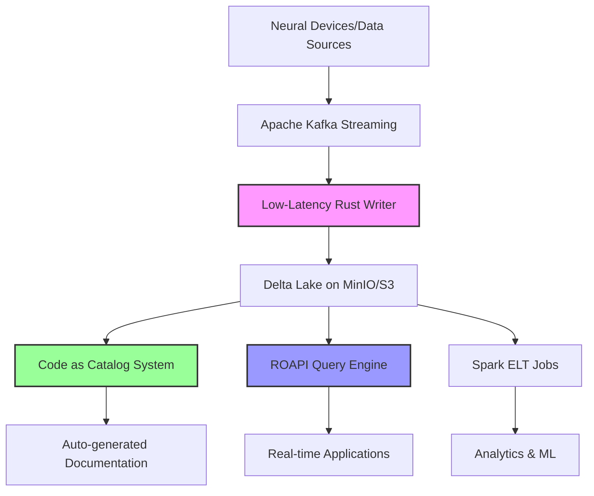

# Neuralake Implementation Roadmap: A New Engineer's Guide

## Executive Summary

We're building a dual-engine data platform inspired by Neuralink's architecture that combines the best of both worlds: **"Surgical Strike"** (Rust/Polars for low-latency operations) and **"Workhorse"** (Spark for massive scale). This document explains where we are, what we still need to build, and why each component matters.

## 🎯 The End-to-End Vision



**The Complete Data Flow:**
1. **Ingestion**: Kafka streams high-velocity data from devices/APIs
2. **Storage**: Low-latency Rust writer appends to Delta Lake with ACID guarantees
3. **Hot Path**: ROAPI + DataFusion serves real-time queries with millisecond latency
4. **Cold Path**: Spark handles massive ELT jobs for analytics and ML
5. **Catalog**: All tables defined in code, auto-generating documentation and APIs
6. **Governance**: Built-in lineage, quality checks, and compliance reporting

## ✅ What We've Built (Foundation Complete)

### Task 1: S3 Integration ✅
**Status**: DONE  
**What**: MinIO local S3-compatible storage with Delta Lake integration  
**Why Critical**: This is our storage foundation. Without reliable object storage, nothing else works.
```python
# We can now do this:
delta_table = DeltaTable("user_events")
delta_table.create(sample_dataframe)
data = delta_table.read()  # ACID-compliant reads
```

### Task 2: Code Quality Tooling ✅  
**Status**: DONE  
**What**: Ruff linter/formatter integrated with development workflow  
**Why Critical**: Ensures code consistency and catches bugs early. Production systems require pristine code quality.

### Task 3: CI/CD Pipeline ✅
**Status**: DONE  
**What**: GitHub Actions with automated testing, linting, and deployment  
**Why Critical**: Prevents broken code from reaching production. Essential for team collaboration.

### Task 4: Core Delta Lake Functionality ✅
**Status**: DONE  
**What**: Complete Delta Lake wrapper with ACID transactions, time travel, schema evolution  
**Why Critical**: This gives us database-grade reliability on object storage. Critical for data integrity.
```python
# Time travel capabilities:
historical_data = delta_table.read(version=5)  # Read old version
comparison = time_travel.compare_versions(1, 3)  # Compare schemas
```

### Task 5: Code as Catalog Core ✅
**Status**: DONE  
**What**: Decorator-based table definitions with static site generation  
**Why Critical**: Eliminates stale documentation. The catalog IS the code.
```python
@table(description="User interaction events")
def user_events() -> pl.LazyFrame:
    """Real-time user events from web/mobile."""
    return delta_table.read().lazy()
```

## 🚧 What We're Building Now

### Task 6: Low-Latency Rust Writer 🔄
**Status**: IN-PROGRESS  
**What**: The "Surgical Strike" component - three-process architecture in Rust
- **Writer Process**: Continuously appends small files with minimal latency
- **Compaction Process**: Merges small files into read-optimized large files  
- **Vacuum Process**: Cleans up old, unreferenced files

**Why Critical**: This solves the "small files problem" while maintaining low-latency ingestion. Essential for real-time applications.

```rust
// High-performance, concurrent Delta operations
let writer = DeltaWriter::new("user_events").await?;
writer.append_batch(neural_signals).await?;  // <1ms latency
```

## 📋 What We Still Need to Build

### Task 7: Enhanced Testing Framework (PENDING)
**What**: Comprehensive testing with Polars as the standard DataFrame library  
**Why**: Ensures reliability at scale. We need bulletproof testing for production systems.
**Dependencies**: Code quality tools (✅), CI/CD (✅)

### Task 8: Enhanced Sample Data Generation (PENDING)  
**What**: Flexible, Polars-based data generation for testing and demos  
**Why**: Realistic test data is essential for validating performance and catching edge cases.

### Task 9: Apache Kafka Integration (PENDING)
**What**: Real-time streaming infrastructure for continuous data ingestion  
**Why**: The nervous system of our platform. Enables real-time applications.
**Dependencies**: Low-latency writer (🚧)

### Task 10: Auto-Generated SQL API (PENDING)
**What**: ROAPI with Apache DataFusion for instant HTTP APIs from table definitions  
**Why**: Zero-maintenance APIs. Any table becomes queryable via SQL over HTTP.
**Dependencies**: Code as Catalog (✅)

```bash
# Automatically generated from table definitions:
curl "http://api/sql" -d "SELECT * FROM user_events WHERE timestamp > NOW() - INTERVAL 1 HOUR"
```

### Task 11: Performance Benchmarking (PENDING)
**What**: Compare Polars/DataFusion vs Spark performance across different workloads  
**Why**: Validates our dual-engine approach. Proves when to use which tool.
**Dependencies**: Testing framework, SQL API

### Task 12: Containerized Spark Environment (PENDING)
**What**: The "Workhorse" for massive ELT jobs  
**Why**: Handles petabyte-scale transformations that are too big for single-machine processing.
**Dependencies**: Delta Lake core (✅)

### Task 13: Large-Scale ELT Jobs (PENDING)
**What**: Reference implementation showing complex Spark transformations  
**Why**: Demonstrates the "Workhorse" side of our dual-engine philosophy.
**Dependencies**: Spark environment

### Task 14: Real-Time Pipeline Integration (PENDING)
**What**: End-to-end pipeline: Kafka → Writer → Delta → ROAPI  
**Why**: The complete real-time data flow. This is where everything comes together.
**Dependencies**: Kafka (Task 9), SQL API (Task 10), Spark ELT (Task 13)

### Tasks 15-17: Advanced Features (PENDING)
- **Enhanced Catalog**: CSV, JDBC, materialized views
- **Monitoring & Governance**: Metrics, lineage, compliance  
- **End-to-End Integration**: Unified deployment, documentation

## 🔄 The Streaming Data Fusion Architecture

Based on the Neuralink architecture document, our system implements a sophisticated **streaming data fusion** pattern:

### The Hot Path (Real-Time)
```
Device Data → Kafka → Rust Writer → Delta Lake → DataFusion → Application
                                                      ↑
                                              Sub-second latency
```

### The Cold Path (Analytics)
```
Delta Lake → Spark → Transformed Data → ML Models/Reports
     ↑
Multi-petabyte scale
```

### Why This Dual-Engine Approach?

1. **Latency vs Throughput Trade-off**: 
   - Rust stack: <1ms latency, moderate throughput
   - Spark stack: High throughput, higher latency

2. **Development Experience**:
   - Rust: Runs on laptop, instant startup, interactive debugging
   - Spark: Requires cluster, slow startup, batch-oriented

3. **Resource Efficiency**:
   - Rust: Minimal memory, single-machine focused
   - Spark: Massive parallelism, cluster-oriented

## 🎯 Critical Success Metrics

1. **End-to-End Latency**: P99 < 100ms from ingestion to query result
2. **Data Freshness**: New data available for queries within seconds  
3. **Developer Velocity**: Complete stack runnable on laptop
4. **Cost Efficiency**: Stateless compute, pay only for what you use
5. **Data Quality**: 99.9%+ accuracy with ACID guarantees

## 🛠️ Getting Started as a New Engineer

### Immediate Setup (5 minutes):
```bash
cd neuralake/
poetry install
docker-compose up -d minio  # Start local S3
poetry run python scripts/production_verification.py
```

### Understanding the Codebase:
1. **Start with**: `src/delta_table.py` - Core Delta Lake operations
2. **Then read**: `src/catalog_core.py` - Code as Catalog system  
3. **Explore**: `tests/` - See how everything works together
4. **Build**: Pick a PENDING task and contribute!

### Key Design Principles:
1. **Scale Down First**: Must work on a laptop before working in production
2. **Composable Libraries**: Prefer libraries over frameworks
3. **Code as Truth**: Configuration and documentation generated from code
4. **Safety by Default**: Rust's compile-time guarantees prevent entire bug classes

## 🚀 The Path Forward

**Phase 1 (Next 2-4 weeks)**: Complete the Rust writer and Kafka integration  
**Phase 2 (Following month)**: Build out the SQL API and performance benchmarking  
**Phase 3 (Quarter goal)**: Full end-to-end pipeline with monitoring

**The vision**: A developer should be able to define a table in code, push to git, and immediately have:
- ACID-compliant storage
- Real-time HTTP APIs  
- Auto-generated documentation
- Performance monitoring
- Data quality checks

All with zero manual configuration or maintenance.

This is not just a data platform - it's a **development platform for data applications** that eliminates the operational overhead of traditional data infrastructure while providing enterprise-grade reliability and performance. 